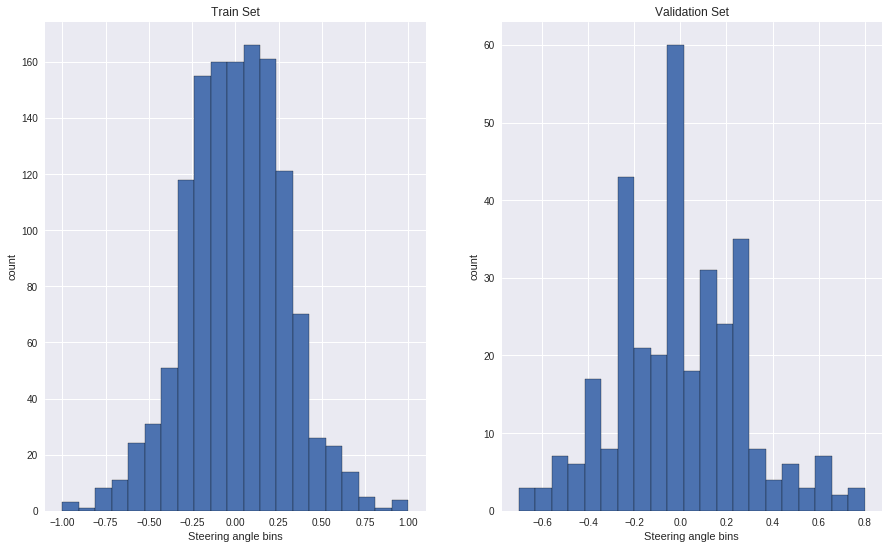
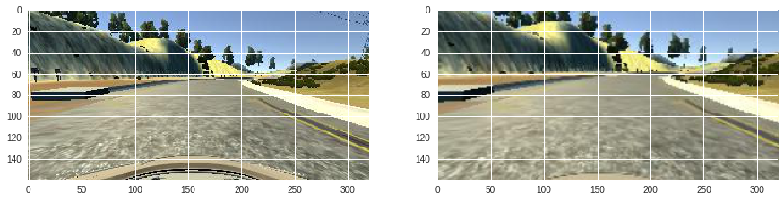
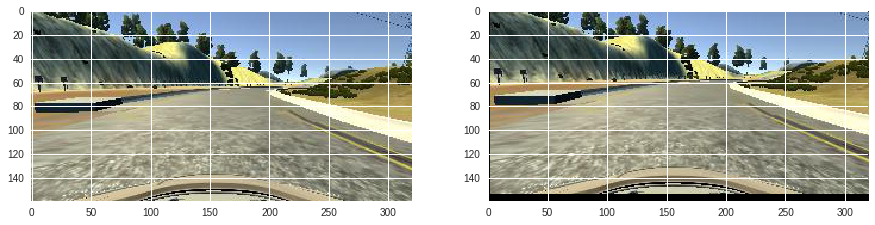
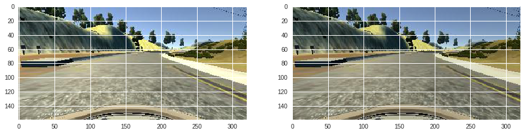
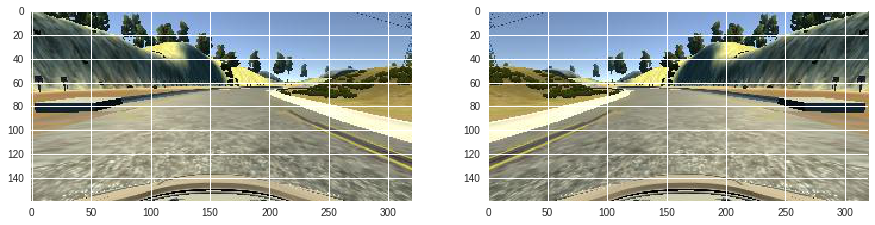
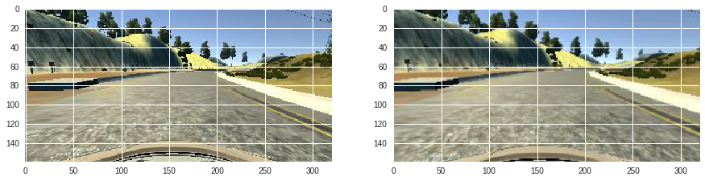
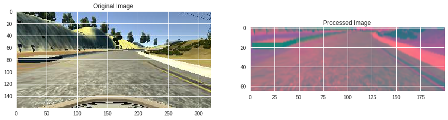
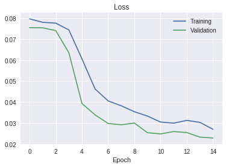

Title: Behavioural Cloning
Date: 2019-01-15 19:35
Category: Deep Learning for Computer Vision

```
import numpy as np
import matplotlib.pyplot as plt
import matplotlib.image as mpimg
import keras
from keras.models import Sequential
from keras.optimizers import Adam
from keras.layers import MaxPooling2D, Conv2D, Dropout, Flatten, Dense
from imgaug import augmenters as iaa
import cv2
import random
import pandas as pd
from sklearn.utils import shuffle
from sklearn.model_selection import train_test_split
%matplotlib inline
```


```
np.random.seed(42)
```


```
!pwd
```

    /content


```
!ls
```

    adc.json  carnd  carnd.zip  sample_data


```
dir_path = "carnd"
cols = ['center', 'left', 'right', 'steering', 'throttle', 'reverse', 'speed']
df = pd.read_csv(dir_path + "/driving_log.csv", names=cols, )
pd.set_option('display.max_colwidth', -1)
df.head()
```


<div>
<style scoped>
    .dataframe tbody tr th:only-of-type {
        vertical-align: middle;
    }

    .dataframe tbody tr th {
        vertical-align: top;
    }

    .dataframe thead th {
        text-align: right;
    }
</style>
<table border="1" class="dataframe">
  <thead>
    <tr style="text-align: right;">
      <th></th>
      <th>center</th>
      <th>left</th>
      <th>right</th>
      <th>steering</th>
      <th>throttle</th>
      <th>reverse</th>
      <th>speed</th>
    </tr>
  </thead>
  <tbody>
    <tr>
      <th>0</th>
      <td>/Users/vikramiyer/Desktop/carnd/IMG/center_2018_12_10_11_33_43_083.jpg</td>
      <td>/Users/vikramiyer/Desktop/carnd/IMG/left_2018_12_10_11_33_43_083.jpg</td>
      <td>/Users/vikramiyer/Desktop/carnd/IMG/right_2018_12_10_11_33_43_083.jpg</td>
      <td>0.0</td>
      <td>0.0</td>
      <td>0</td>
      <td>25.10953</td>
    </tr>
    <tr>
      <th>1</th>
      <td>/Users/vikramiyer/Desktop/carnd/IMG/center_2018_12_10_11_33_43_156.jpg</td>
      <td>/Users/vikramiyer/Desktop/carnd/IMG/left_2018_12_10_11_33_43_156.jpg</td>
      <td>/Users/vikramiyer/Desktop/carnd/IMG/right_2018_12_10_11_33_43_156.jpg</td>
      <td>0.0</td>
      <td>0.0</td>
      <td>0</td>
      <td>24.90617</td>
    </tr>
    <tr>
      <th>2</th>
      <td>/Users/vikramiyer/Desktop/carnd/IMG/center_2018_12_10_11_33_43_223.jpg</td>
      <td>/Users/vikramiyer/Desktop/carnd/IMG/left_2018_12_10_11_33_43_223.jpg</td>
      <td>/Users/vikramiyer/Desktop/carnd/IMG/right_2018_12_10_11_33_43_223.jpg</td>
      <td>0.0</td>
      <td>0.0</td>
      <td>0</td>
      <td>24.75472</td>
    </tr>
    <tr>
      <th>3</th>
      <td>/Users/vikramiyer/Desktop/carnd/IMG/center_2018_12_10_11_33_43_295.jpg</td>
      <td>/Users/vikramiyer/Desktop/carnd/IMG/left_2018_12_10_11_33_43_295.jpg</td>
      <td>/Users/vikramiyer/Desktop/carnd/IMG/right_2018_12_10_11_33_43_295.jpg</td>
      <td>0.0</td>
      <td>0.0</td>
      <td>0</td>
      <td>24.55421</td>
    </tr>
    <tr>
      <th>4</th>
      <td>/Users/vikramiyer/Desktop/carnd/IMG/center_2018_12_10_11_33_43_363.jpg</td>
      <td>/Users/vikramiyer/Desktop/carnd/IMG/left_2018_12_10_11_33_43_363.jpg</td>
      <td>/Users/vikramiyer/Desktop/carnd/IMG/right_2018_12_10_11_33_43_363.jpg</td>
      <td>0.0</td>
      <td>0.0</td>
      <td>0</td>
      <td>24.40489</td>
    </tr>
  </tbody>
</table>
</div>


```
def get_correct_file_path(x):
  return x.split('/')[-1]
```


```
df['center'] = df['center'].apply(get_correct_file_path)
df['right'] = df['right'].apply(get_correct_file_path)
df['left'] = df['left'].apply(get_correct_file_path)
```


```
total_bins = 21
hist, bins = np.histogram(df['steering'], total_bins)
```


```
center = (bins[:-1] + bins[1:]) * 0.5
```


```
plt.bar(center, hist, width=0.05)
```


    <Container object of 21 artists>


```
bin_threshold = 200
remove_ixs = []
for i in range(total_bins):
  temp_list = []
  for j in range(df.steering.size):
    if df['steering'][j] >= bins[i] and df['steering'][j] <= bins[i+1]:
      temp_list.append(j)
  # ensure that data is dropped randomly rather than a specific portion of the recording
  temp_list = shuffle(temp_list)
  temp_list = temp_list[bin_threshold:]
  remove_ixs.extend(temp_list)
print("Before: ", df.size)
df.drop(df.index[remove_ixs], inplace=True)
print("After: ", df.size)
```

    Before:  50582
    After:  11494


```
hist, _ = np.histogram(df['steering'], total_bins)
plt.bar(center, hist, width=0.05)
```


    <Container object of 21 artists>


```
imgdir = 'carnd/IMG/'
def load_data(df):
  path = []
  measurement = []
  for i in range(len(df)):
    ixs = df.iloc[i]
    center, left, right = ixs[0], ixs[1], ixs[2]
    path.append(imgdir + center.strip())
#     path.append(imgdir + left.strip())
#     path.append(imgdir + right.strip())
    measurement.append(float(ixs[3]))
  paths = np.asarray(path)
  measurements = np.asarray(measurement)
  return paths, measurements

paths, measurements = load_data(df)
```


```
paths.shape, measurements.shape
```


    ((1642,), (1642,))


```
X_train, X_valid, y_train, y_valid = train_test_split(paths, measurements, test_size=0.2, random_state=42)
```


```
X_train.shape, X_valid.shape
```


    ((1313,), (329,))


```
fig, (ax1, ax2) = plt.subplots(1, 2, figsize=(15,9))
ax1.hist(y_train, bins=total_bins, edgecolor='black');
ax1.set_title("Train Set");
ax1.set_ylabel("count");
ax1.set_xlabel("Steering angle bins");
ax2.hist(y_valid, bins=total_bins, edgecolor='black');
ax2.set_title("Validation Set");
ax2.set_ylabel("count");
ax2.set_xlabel("Steering angle bins");
```





```
def zoom(img):
  zoomed = iaa.Affine(scale=(1,1.3))
  return zoomed.augment_image(img)

def pan(img):
  panned = iaa.Affine(translate_percent={'x': (-0.1,0.1), 'y': (-0.1,0.1)})
  return panned.augment_image(img)

def alter_brightness(img):
  b = iaa.Multiply((0.2, 1.2))
  return b.augment_image(img)

def flip_image(img, steering_ang):
  img = cv2.flip(img, 1)
  return img, -steering_ang

def augment_data(img, ang):
  if np.random.rand() < 0.5:
    img = zoom(img)
  if np.random.rand() < 0.5:
    img = pan(img)
  if np.random.rand() < 0.5:
    img = alter_brightness(img)
  if np.random.rand() < 0.5:
    img = flip_image(img)
  return img, ang
```


```
img_path = paths[925]
orig_img = mpimg.imread(img_path)
zoomed_img = zoom(orig_img)
fig, (ax1, ax2) = plt.subplots(1, 2, figsize=(15,9))
ax1.imshow(orig_img);
ax2.imshow(zoomed_img);
```





```
img_path = paths[925]
orig_img = mpimg.imread(img_path)
panned_img = pan(orig_img)
fig, (ax1, ax2) = plt.subplots(1, 2, figsize=(15,9))
ax1.imshow(orig_img);
ax2.imshow(panned_img);
```





```
img_path = paths[925]
orig_img = mpimg.imread(img_path)
brightness_altered_img = alter_brightness(orig_img)
fig, (ax1, ax2) = plt.subplots(1, 2, figsize=(15,9))
ax1.imshow(orig_img);
ax2.imshow(brightness_altered_img);
```





```
img_path = paths[925]
ang = measurements[925]
orig_img = mpimg.imread(img_path)
flipped_img, flipped_ang = flip_image(orig_img, ang)
fig, (ax1, ax2) = plt.subplots(1, 2, figsize=(15,9))
ax1.imshow(orig_img);
ax2.imshow(flipped_img);
```





```
img_path = paths[925]
orig_img = mpimg.imread(img_path)
zoomed_img = zoom(orig_img)
fig, (ax1, ax2) = plt.subplots(1, 2, figsize=(15,9))
ax1.imshow(orig_img);
ax2.imshow(zoomed_img);
```





```
def preprocess(img_path):
  # convert to YUV space as Nvidia Model we will use has used the same space
  img = cv2.cvtColor(cv2.imread(img_path), cv2.COLOR_BGR2YUV)
  # slice the unwanted sections from the image
  img = img[60:135,:,:]
  # smooth the image using a gaussian kernel: denoise
  img = cv2.GaussianBlur(img, (3, 3), 0)
  # reshape to fit the input size of Nvidia Model
  img = cv2.resize(img, (200, 66))
  # normalize
  img = img/255
  return img

```


```
# random_number = np.random.randint(len(X_train)-1)
random_number = 925
img = paths[random_number]
orig_img = mpimg.imread(img)
processed_img = preprocess(img)

fig, (ax1, ax2) = plt.subplots(1, 2, figsize=(15,9))
ax1.imshow(orig_img);
ax1.set_title("Original Image");
ax2.imshow(processed_img);
ax2.set_title("Processed Image");
```





```
X_train = np.array(list(map(preprocess, X_train)))
X_valid = np.array(list(map(preprocess, X_valid)))
```


```
X_train.shape, X_valid.shape
```


    ((1313, 66, 200, 3), (329, 66, 200, 3))


```
#Model
def NvidiaModel():

  # defining our model
  model = Sequential()

  # 1 conv2D layer=> input: 66x200x3, total_params: 5x5x24x3+24=1824
  model.add(Conv2D(24, (5, 5), strides=(2,2), input_shape=(66, 200, 3), activation='relu'))

  # 2 conv2D layer=> input: 31x98x24, total_params: 5x5x36x24+36=21636
  model.add(Conv2D(36, (5, 5), strides=(2,2), activation='relu'))

  # 3 conv2D layer=> input: 14x47x36, total_params: 5x5x48x36+48=43248
  model.add(Conv2D(48, (5, 5), strides=(2,2), activation='relu'))

  # 4 conv2D layer=> input: 5x22x48, total_params=3x3x64x48+64=27712
  model.add(Conv2D(64, (3, 3), activation='relu'))

  # 5 conv2D layer=> input: 3x20x64, total_params: 3x3x64x64+64=36928, output_shape=(1x18x64)
  model.add(Conv2D(64, (3, 3), activation='relu'))

  # Dropout=> total_params=0, output_shape=1x18x64
  model.add(Dropout(0.5))

  # Flatten=> total_params=0, output_shape: 1152
  model.add(Flatten())

  # Dense=> output_shape=100, total_params=1152x100+100=115300
  model.add(Dense(100, activation='relu'))

  # Dropout=> total_params=0, output_shape=100
  model.add(Dropout(0.5))

  # Dense=> total_params=100x50+50=5050
  model.add(Dense(50, activation='relu'))

  # Dense=> total_params=50x10+10=510
  model.add(Dense(10, activation='relu'))

  # Dense=> total_params=10x1+1=11
  model.add(Dense(1))

  # compile
  optimizer=Adam(lr=0.001)
  model.compile(loss='mse', optimizer=optimizer)
  return model
```


```
model = NvidiaModel()
```


```
model.summary()
```

    _________________________________________________________________
    Layer (type)                 Output Shape              Param #   
    =================================================================
    conv2d_1 (Conv2D)            (None, 31, 98, 24)        1824      
    _________________________________________________________________
    conv2d_2 (Conv2D)            (None, 14, 47, 36)        21636     
    _________________________________________________________________
    conv2d_3 (Conv2D)            (None, 5, 22, 48)         43248     
    _________________________________________________________________
    conv2d_4 (Conv2D)            (None, 3, 20, 64)         27712     
    _________________________________________________________________
    conv2d_5 (Conv2D)            (None, 1, 18, 64)         36928     
    _________________________________________________________________
    dropout_1 (Dropout)          (None, 1, 18, 64)         0         
    _________________________________________________________________
    flatten_1 (Flatten)          (None, 1152)              0         
    _________________________________________________________________
    dense_1 (Dense)              (None, 100)               115300    
    _________________________________________________________________
    dropout_2 (Dropout)          (None, 100)               0         
    _________________________________________________________________
    dense_2 (Dense)              (None, 50)                5050      
    _________________________________________________________________
    dense_3 (Dense)              (None, 10)                510       
    _________________________________________________________________
    dense_4 (Dense)              (None, 1)                 11        
    =================================================================
    Total params: 252,219
    Trainable params: 252,219
    Non-trainable params: 0
    _________________________________________________________________


```
history = model.fit(X_train, y_train, validation_data=(X_valid, y_valid), epochs=15, batch_size=64, shuffle=1)
```

    Train on 1313 samples, validate on 329 samples
    Epoch 1/15
    1313/1313 [==============================] - 13s 10ms/step - loss: 0.0797 - val_loss: 0.0755
    Epoch 2/15
    1313/1313 [==============================] - 12s 9ms/step - loss: 0.0780 - val_loss: 0.0754
    Epoch 3/15
    1313/1313 [==============================] - 12s 9ms/step - loss: 0.0776 - val_loss: 0.0741
    Epoch 4/15
    1313/1313 [==============================] - 12s 9ms/step - loss: 0.0744 - val_loss: 0.0635
    Epoch 5/15
    1313/1313 [==============================] - 12s 9ms/step - loss: 0.0606 - val_loss: 0.0393
    Epoch 6/15
    1313/1313 [==============================] - 12s 9ms/step - loss: 0.0462 - val_loss: 0.0339
    Epoch 7/15
    1313/1313 [==============================] - 12s 9ms/step - loss: 0.0405 - val_loss: 0.0298
    Epoch 8/15
    1313/1313 [==============================] - 12s 9ms/step - loss: 0.0382 - val_loss: 0.0292
    Epoch 9/15
    1313/1313 [==============================] - 12s 9ms/step - loss: 0.0354 - val_loss: 0.0300
    Epoch 10/15
    1313/1313 [==============================] - 12s 9ms/step - loss: 0.0333 - val_loss: 0.0254
    Epoch 11/15
    1313/1313 [==============================] - 12s 9ms/step - loss: 0.0305 - val_loss: 0.0248
    Epoch 12/15
    1313/1313 [==============================] - 12s 9ms/step - loss: 0.0299 - val_loss: 0.0259
    Epoch 13/15
    1313/1313 [==============================] - 12s 9ms/step - loss: 0.0313 - val_loss: 0.0255
    Epoch 14/15
    1313/1313 [==============================] - 12s 9ms/step - loss: 0.0303 - val_loss: 0.0233
    Epoch 15/15
    1313/1313 [==============================] - 12s 9ms/step - loss: 0.0270 - val_loss: 0.0229


```
plt.plot(history.history['loss']);
plt.plot(history.history['val_loss']);
plt.legend(['Training','Validation']);
plt.title('Loss');
plt.xlabel('Epoch');
```





```
model.save("model.h5")
```


```
from google.colab import files
files.download("model.h5")
```
